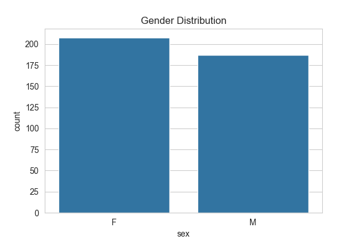
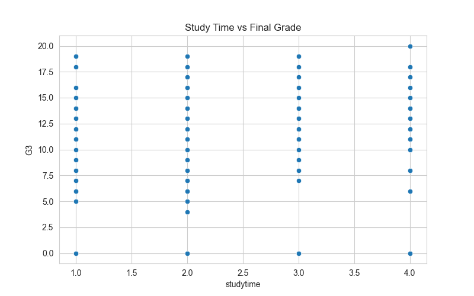
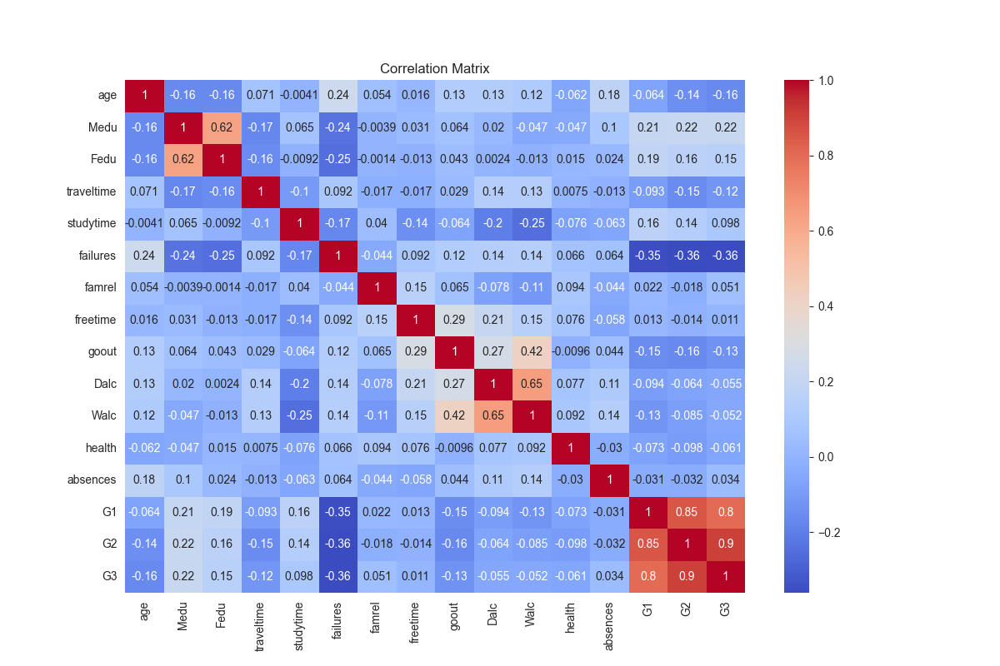

# Student Performance EDA

## Project Overview

This project performs Exploratory Data Analysis (EDA) on a student performance dataset to identify factors affecting academic success.

## Dataset Features

- Demographics (Age, Gender, Address)
- Family Background
- Study Time
- Failures
- Absences
- Previous Grades (G1, G2)
- Final Grade (G3)

## Technologies Used

- Python
- Pandas
- NumPy
- Matplotlib
- Seaborn
- Jupyter Notebook

## Analysis Performed

1. Data Loading and Inspection
2. Missing Value Analysis
3. Statistical Summary
4. Gender Distribution Analysis
5. Study Time vs Final Grade Analysis
6. Correlation Heatmap

## Visualizations

### Gender Distribution

### Study Time vs Final Grade

### Correlation Heatmap

## Key Findings

- Study time positively influences final grades.
- Previous grades (G1 and G2) strongly correlate with G3.
- Failures negatively impact student performance.
- Attendance and academic consistency affect outcomes.

## Conclusion

Student performance is influenced by study habits, previous academic records, and attendance patterns. Data analysis helps identify key areas for improving educational outcomes.